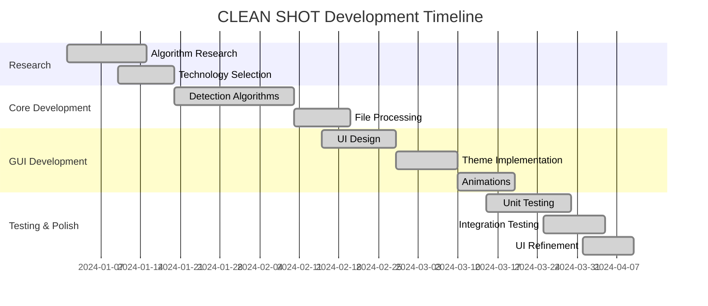

# 3. Methodology

## 3.1 Development Approach

CLEAN SHOT was developed using an **Iterative and Incremental** development methodology, combining best practices from Agile development with a focus on modular design.

### Development Phases



## 3.2 Development Phases

### Phase 1: Research & Planning
- Evaluated blur detection algorithms (Laplacian, Sobel, FFT)
- Compared perceptual hashing libraries (ImageHash, pHash)
- Selected GUI framework (PySide6 over Tkinter, PyQt)
- Defined detection accuracy requirements

### Phase 2: Core Algorithm Development
- Implemented BlurDetector with multi-metric scoring
- Developed DuplicateDetector with weighted multi-hash comparison
- Integrated FaceDetector using OpenCV Haar cascades
- Added optional DeepFace support for advanced face recognition

### Phase 3: GUI Development
- Designed modern UI with dark theme
- Implemented custom widgets (AnimatedButton, GlowCard, FadeLabel)
- Created responsive layouts with progress tracking
- Added configuration panels with preset thresholds

### Phase 4: Integration & Testing
- Connected GUI with worker threads
- Implemented signal-based communication
- Created comprehensive unit tests
- Performed integration testing

### Phase 5: Refinement & Documentation
- UI polish and animation tuning
- Performance optimization
- Error handling improvements
- Documentation creation

## 3.3 Software Development Lifecycle

```
    ┌─────────────┐
    │ Requirements│
    │   Analysis  │
    └──────┬──────┘
           │
           ▼
    ┌─────────────┐
    │   Design    │◄──────────────┐
    │ (Architecture│               │
    │  & Modules) │               │
    └──────┬──────┘               │
           │                      │ Feedback
           ▼                      │ Loop
    ┌─────────────┐               │
    │Implementation│──────────────┤
    │ (Core+GUI)  │               │
    └──────┬──────┘               │
           │                      │
           ▼                      │
    ┌─────────────┐               │
    │   Testing   │───────────────┘
    │ (Unit+Int.) │
    └──────┬──────┘
           │
           ▼
    ┌─────────────┐
    │ Deployment  │
    │ & Release   │
    └─────────────┘
```

## 3.4 Design Principles

### 3.4.1 Separation of Concerns
Each component has a single, well-defined responsibility:
- **Detectors**: Only perform detection, no file operations
- **Workers**: Handle threading and processing orchestration
- **GUI**: Only presentation logic, no business logic
- **Validators**: Only input validation

### 3.4.2 Modularity
Components are designed to be:
- **Independent**: Can be tested and developed separately
- **Reusable**: Detectors can be used in other applications
- **Replaceable**: Easy to swap implementations (e.g., different face detector)

### 3.4.3 Thread Safety
- All heavy processing runs in background threads
- UI updates only via signal/slot mechanism
- Pause/resume functionality with proper mutex locking

### 3.4.4 User-Centric Design
- Clear visual feedback for all operations
- Undo capability for confidence
- Configurable thresholds with presets
- Comprehensive error messages

## 3.5 Version Control

The project uses Git for version control with the following branch strategy:

| Branch | Purpose |
|--------|---------|
| `main` | Stable, production-ready code |
| `master` | Development branch |
| `feature/*` | New feature development |
| `bugfix/*` | Bug fixes |

**Repository**: https://github.com/Shazad2737/clean-shot-photo-organizer
